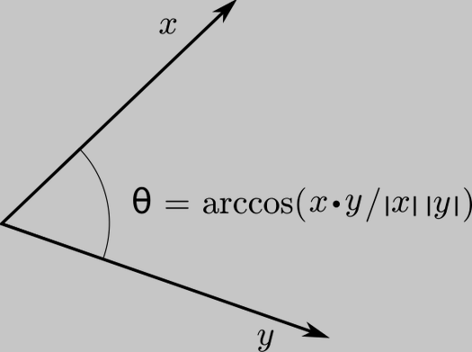

# <ins> **Implementation of Dot-Product Using Python3** </ins>



> "Scalar product" redirects here. For the abstract scalar product, see Inner product space. For the product of a vector and a scalar, see Scalar multiplication.

In mathematics, the **dot product** or **scalar product**[^1] is an algebraic operation that takes two equal-length sequences of numbers (usually coordinate vectors), and returns a single number. In Euclidean geometry, the dot product of the Cartesian coordinates of two vectors is widely used. It is often called the **inner product** (or rarely the projection product) of Euclidean space, even though it is not the only inner product that can be defined on Euclidean space (see Inner product space for more).

Algebraically, the dot product is the sum of the products of the corresponding entries of the two sequences of numbers. Geometrically, it is the product of the Euclidean magnitudes of the two vectors and the cosine of the angle between them. These definitions are equivalent when using Cartesian coordinates. In modern geometry, Euclidean spaces are often defined by using vector spaces. In this case, the dot product is used for defining lengths (the length of a vector is the square root of the dot product of the vector by itself) and angles (the cosine of the angle between two vectors is the quotient of their dot product by the product of their lengths).

The name "dot product" is derived from the [dot operator](https://en.wikipedia.org/wiki/Dot_product) " · " that is often used to designate this operation[^2] the alternative name "scalar product" emphasizes that the result is a scalar, rather than a vector (as with the vector product in three-dimensional space). 

## Definition

The dot product may be defined algebraically or geometrically. The geometric definition is based on the notions of angle and distance (magnitude) of vectors. The equivalence of these two definitions relies on having a Cartesian coordinate system for Euclidean space. 

**Coordinate definition**

The dot product of two vectors $ {\displaystyle \mathbf {a} =[a_{1},a_{2},\cdots ,a_{n}]} $ and ${\displaystyle \mathbf {b} =[b_{1},b_{2},\cdots ,b_{n}]} $, specified with respect to an orthonormal basis, is defined as

$$ \displaystyle \sum_{k=3}^{5} k^2 = 3^2 + 4^2 + 5^2 = 50 $$

## Python Code for Dot-Product

> [!TIP]
> Copy this code and try to run in your local machine

```python
# function for dot product
def dotProduct(vect_A, vect_B):

    product = 0

    # Loop for calculate dot product
    for i in range(0, 3):
        product = product + vect_A[i] * vect_B[i]

    return product
```

> [!NOTE]
> always check indentation before interpreting the python3 code


try to implement using these programming languages

- [ ] C
- [ ] C++
- [ ] Lua
- [ ] Java
- [ ] JavaScript
- [ ] Go
- [ ] Rust


[^1]: The term scalar product means literally "product with a scalar as a result". It is also used sometimes for other symmetric bilinear forms, for example in a pseudo-Euclidean space. Not to be confused with scalar multiplication.

[^2]: ["Dot Product"](https://www.mathsisfun.com/algebra/vectors-dot-product.html). www.mathsisfun.com. Retrieved 2020-09-06.